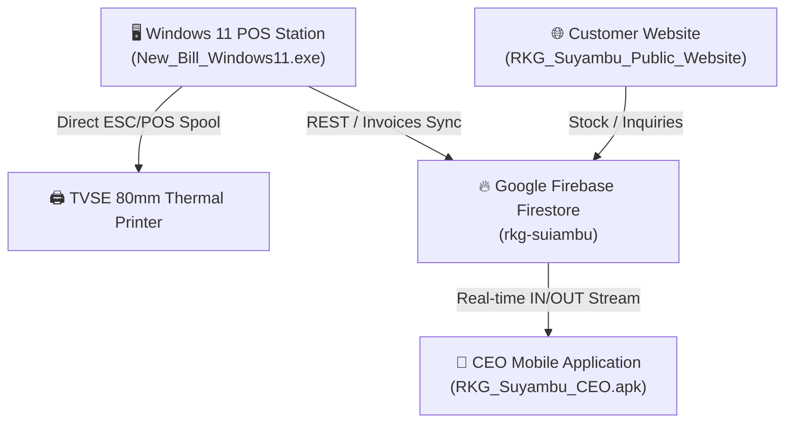

# 🌾 RKG SUYAMBU — DEPLOYED SUITE (VERSION 0.1)

Official enterprise software ecosystem for **RKG Suyambu Agro Products & Cattle Feed Mills**.

---

## 📦 Suite Components (Version 0.1)

### 1. 📱 Suyambu CEO Mobile Application (APK)
* **Direct Binary:** [`RKG_Suyambu_CEO.apk`](./RKG_Suyambu_CEO.apk)
* **Full Source:** [`RKG_Suyambu_Android_Studio_Project/`](./RKG_Suyambu_Android_Studio_Project/)
* **PWA Web App:** [`mobile.html`](./RKG_Suyambu_Public_Website/mobile.html) / [`mobile.js`](./RKG_Suyambu_Public_Website/mobile.js)
* **Key Features:**
  * Real-time **Daily IN / OUT** tracking directly synchronized with Google Cloud Firestore (`rkg-suiambu`).
  * Instant sales revenue breakdown: Total Cash vs. UPI payments.
  * Live stock deductions and warehouse dispatch auditing.
  * Interactive calendar with date filtering (Today, Yesterday, Custom date range) and pull-to-refresh sync.
  * Biometric / PIN secure authentication for CEO Master Control.

---

### 2. 🖥️ Suyambu New Billing Windows 11 POS (EXE)
* **Direct Binary:** [`RKG_Suyambu_Windows11_POS/New_Bill_Windows11.exe`](./RKG_Suyambu_Windows11_POS/New_Bill_Windows11.exe)
* **Full Source Code:** [`RKG_Suyambu_Windows11_POS/RKG_Suyambu_Billing_Universal.cs`](./RKG_Suyambu_Windows11_POS/RKG_Suyambu_Billing_Universal.cs)
* **Key Features:**
  * **Dynamic Logo Status Badges (Top-Center):**
    * **`● CLOUD`** badge: Emerald Green when Firebase sync is active; Ash/Slate Gray when offline.
    * **`● PRINTER`** badge: Emerald Green when TVS 80mm ESC/POS hardware is connected; Ash/Slate Gray when disconnected.
  * **Direct Hardware Spooler:** Native Win32 `winspool.Drv` RAW streaming bypass for instantaneous 80mm TVS RP3200 thermal receipts.
  * **Resilient Dual-Engine:** Instant local SQLite offline storage (`pos_local.db`) with automatic cloud sync queue.
  * **Comprehensive Product Catalog:** Oils (Groundnut, Sesame, Coconut, Gingelly), Cattle Feeds (Nayam, Special Mash, Milk-Yield Pellets), Traditional Rice & Millets.
  * Sequential billing (`RKG-2026-XXXX`) with barcode scanner integration and promo vouchers.

---

### 3. 🌐 Suyambu Customer Website & Web Application
* **Directory:** [`RKG_Suyambu_Public_Website/`](./RKG_Suyambu_Public_Website/)
* **Core Files:** [`index.html`](./RKG_Suyambu_Public_Website/index.html), [`website.html`](./RKG_Suyambu_Public_Website/website.html), [`website.js`](./RKG_Suyambu_Public_Website/website.js), [`website.css`](./RKG_Suyambu_Public_Website/website.css), [`ceo.html`](./RKG_Suyambu_Public_Website/ceo.html)
* **Key Features:**
  * High-definition visual product showcase with 29+ authentic packaging images for all product categories.
  * WhatsApp direct order dispatch (`+91 94425 24147` / `+91 98427 24147`).
  * Live dynamic stock availability synchronization from Firebase Firestore (`/products`).
  * Progressive Web App (PWA) with offline caching (`sw.js` and `manifest.json`).

---

## 🚀 Live Cloud & Hardware Architecture

---

## 📋 Version Information
* **Release:** `v0.1` (Deployed Production)
* **Date:** October 2026
* **Maintainer:** RKG Suyambu IT & Operations
